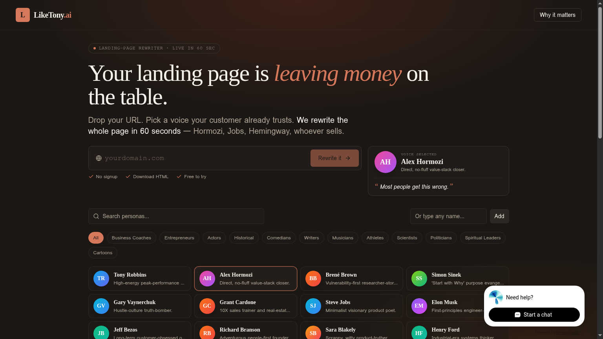
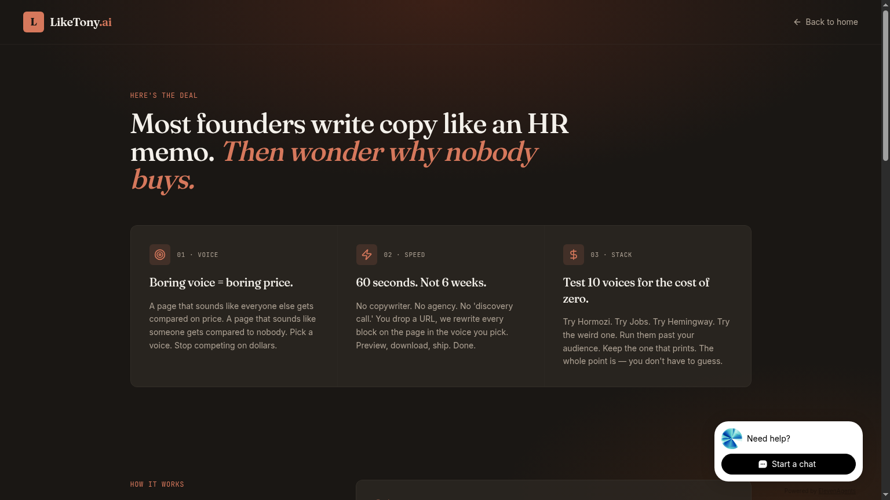

# LikeTony.ai

> **Your landing page is leaving money on the table.**
> Drop your URL. Pick a voice your customer already trusts. Get the whole page rewritten in 60 seconds — Hormozi, Jobs, Hemingway, whoever sells.

[](https://liketony.ai)
[](https://vitejs.dev)
[](https://lovable.dev)



---

## What it does

LikeTony.ai is a **landing-page voice rewriter**. You give it a live URL, pick a personality from a curated catalog of 100+ voices (or type any name), and it returns your *exact same page* — same layout, same images, same CSS — but with every headline, paragraph and CTA rewritten in that voice.

No signup. No account. No monthly subscription. **One-time $19.99** per HTML download, paid through Stripe Checkout, delivered to your email.

## Why it exists

Most founders write copy like an HR memo. Then wonder why nobody buys.

A page that sounds like everyone else gets compared on price. A page that sounds like *someone* gets compared to nobody. The fastest way to find your voice isn't a 6-week branding workshop — it's stealing one. For 60 seconds. Just to see what happens.



## How it works

1. **Drop your URL.** We pull your live page and break it into rewritable text blocks while preserving the entire DOM.
2. **Pick a voice.** Hormozi, Jobs, Musk, Hemingway, Carlin, Churchill — 100+ curated personas across business, history, comedy, sports, science. Or type any name and we'll generate the voice profile on the fly.
3. **Preview, pay, ship.** Side-by-side preview against the original. One-time checkout. Download the rewritten `.html` and upload it anywhere.

```
URL  ─►  Scrape (Firecrawl)  ─►  Extract text segments  ─►
        Lovable AI Gateway (Gemini / GPT)  ─►  Reinsert by index  ─►
        Preview + Stripe Checkout ($19.99)  ─►  Email delivers HTML
```

## Persona catalog

A curated, hand-tuned voice library — each persona ships with a `voice_prompt` defining tone, lexicon, rhythm, signature moves and forbidden patterns. Categories include:

- **Business coaches** — Hormozi, Tony Robbins, Brené Brown, Simon Sinek
- **Entrepreneurs** — Jobs, Musk, Bezos, Branson, Sara Blakely
- **Historical figures** — Churchill, Napoleon, Cleopatra, MLK
- **Comedians** — Carlin, Chappelle, Hannah Gadsby
- **Writers** — Hemingway, Bukowski, Tolkien
- **Athletes, politicians, musicians, scientists, spiritual leaders, cartoons…**

Don't see who you want? Type the name, hit **Add**, and a custom voice profile is generated and cached.

## Stack

| Layer | Tool |
|---|---|
| Frontend | React 18, Vite 5, TypeScript, Tailwind, shadcn/ui |
| Backend | Lovable Cloud (managed Supabase) |
| Scraping | Firecrawl |
| AI | Lovable AI Gateway (Gemini 2.5 / GPT-5) |
| Payments | Stripe Checkout (live) |
| Email | Lovable Emails on `notify.liketony.ai` |
| Hosting | Lovable |

### Edge functions

- `process-site` — Firecrawl scrape + segment extraction + AI rewrite + final HTML assembly
- `generate-persona` — synthesize voice profile for custom names
- `create-checkout` / `verify-payment` / `poll-stripe-payments` — Stripe one-time payment flow
- `send-transactional-email` — delivers download link via the `rewrite-download` template
- `download-html` — signed download endpoint

## Project structure

```
src/
  pages/         Index, WhyItMatters, Success, Download, SharedRewrite, …
  components/    DomainBar, PersonaCatalog, Workspace, SellingScoreCard
  data/          personas.ts (curated voice library)
  lib/           preview-html.ts, persona-stages.ts
supabase/
  functions/     edge functions (see above)
  _shared/       landing.ts, transactional email templates
```

## Local development

```bash
npm install
npm run dev
```

The app runs against the live Lovable Cloud backend — no local Supabase needed. Environment variables in `.env` are auto-managed.

## License

Proprietary. © LikeTony.ai
